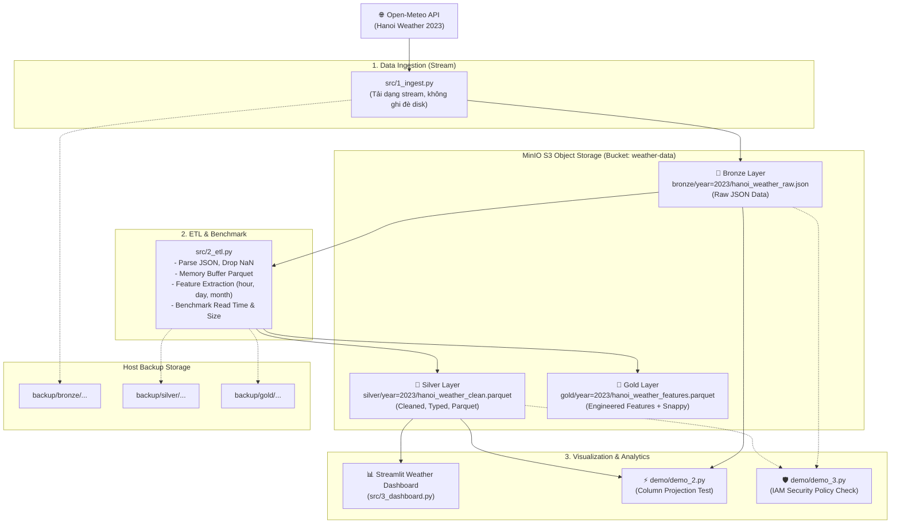
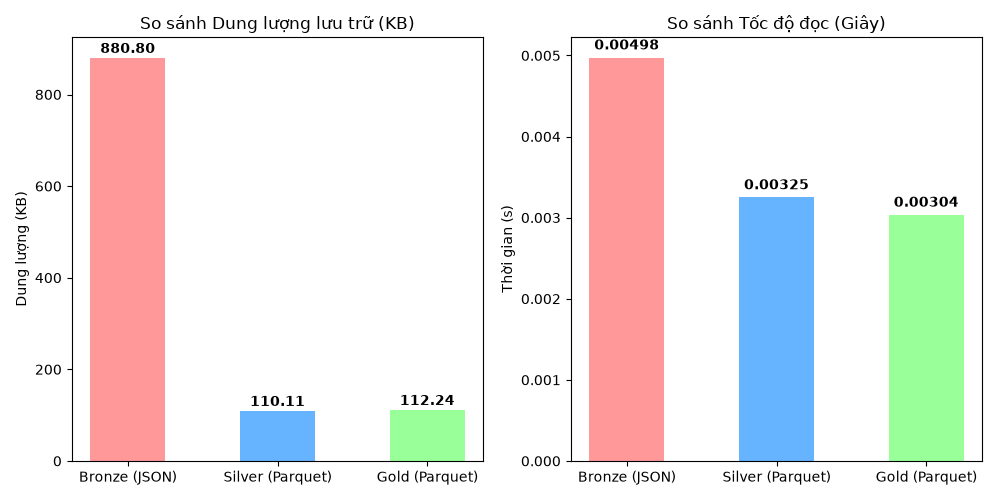

# 🌤️ Weather Data Lakehouse Pipeline with MinIO & Streamlit

Xây dựng hệ thống **Data Lakehouse** tự động hóa thu thập, xử lý và trực quan hóa dữ liệu thời tiết theo kiến trúc **Medallion Architecture (Bronze → Silver → Gold)**. Dự án kết hợp công nghệ **MinIO S3-compatible Object Storage**, định dạng lưu trữ cột **Apache Parquet**, cơ chế bảo mật phân quyền **MinIO IAM (Least Privilege)** và giao diện hiển thị **Streamlit Dashboard** hiện đại.

---

## 📌 Mục lục

- [Kiến trúc hệ thống](#-kiến-trúc-hệ-thống)
- [Cấu trúc thư mục](#-cấu-trúc-thư-mục)
- [Yêu cầu hệ thống](#-yêu-cầu-hệ-thống)
- [Hướng dẫn cài đặt & Khởi chạy](#-hướng-dẫn-cài-đặt--khởi-chạy)
  - [Bước 1: Clone mã nguồn & Cài đặt môi trường Python](#bước-1-clone-mã-nguồn--cài-đặt-môi-trường-python)
  - [Bước 2: Cấu hình biến môi trường (.env)](#bước-2-cấu-hình-biến-môi-trường-env)
  - [Bước 3: Khởi động MinIO & Hạ tầng dịch vụ (Docker Compose)](#bước-3-khởi-động-minio--hạ-tầng-dịch-vụ-docker-compose)
  - [Bước 4: Chạy Data Pipeline](#bước-4-chạy-data-pipeline)
  - [Bước 5: Khởi chạy Streamlit Dashboard](#bước-5-khởi-chạy-streamlit-dashboard)
- [Kịch bản Demo & Thực nghiệm nâng cao](#-kịch-bản-demo--thực-nghiệm-nâng-cao)
  - [1. Benchmark Column Projection (Parquet vs JSON)](#1-benchmark-column-projection-parquet-vs-json)
  - [2. Kiểm thử bảo mật phân quyền IAM (Least Privilege)](#2-kiểm-thử-bảo-mật-phân-quyền-iam-least-privilege)
- [So sánh hiệu năng & Dung lượng (Benchmark)](#-so-sánh-hiệu-năng--dung-lượng-benchmark)
- [Bảng thông tin các cổng dịch vụ](#-bảng-thông-tin-các-cổng-dịch-vụ)
- [Xử lý sự cố thường gặp (Troubleshooting)](#-xử-lý-sự-cố-thường-gặp-troubleshooting)

---

## 🏛️ Kiến trúc hệ thống

Dữ liệu được tổ chức và quản lý theo chuẩn **Medallion Architecture**:



1. **Bronze Layer (Raw)**: Chứa dữ liệu gốc nguyên bản được tải từ Open-Meteo API dưới định dạng JSON thô. Đẩy trực tiếp qua Stream bộ nhớ lên MinIO và tạo bản sao lưu tại `backup/`.
2. **Silver Layer (Cleaned)**: Xử lý làm sạch, chuẩn hóa kiểu dữ liệu datetime, xử lý missing values, nén dạng columnar với Apache Parquet (tối ưu dung lượng và tốc độ truy vấn).
3. **Gold Layer (Aggregated / Features)**: Trích xuất các đặc trưng thời gian (`hour`, `day`, `month`), nén Snappy tối ưu cho tác vụ phân tích thời tiết chuyên sâu và Machine Learning.
4. **Presentation Layer**: Streamlit Dashboard giao diện Dark Mode hiển thị trực quan các chỉ số thời tiết, biểu đồ nhiệt độ 48 giờ, độ ẩm, áp suất, AQI và dự báo.

---

## 📂 Cấu trúc thư mục

```text
weather-minio-pipeline/
├── .env.example              # File mẫu cấu hình biến môi trường
├── .env                      # File cấu hình biến môi trường (tạo từ .env.example)
├── docker-compose.yml        # Định nghĩa các container: MinIO, mc, Spark Iceberg, Iceberg REST
├── requirements.txt          # Danh sách thư viện Python phụ thuộc
├── run_pipeline.py           # Script tự động thực thi toàn bộ pipeline (Ingest -> ETL)
├── benchmark_chart.png       # Biểu đồ so sánh dung lượng và tốc độ đọc (Bronze vs Silver vs Gold)
│
├── src/                      # Mã nguồn chính của pipeline
│   ├── 1_ingest.py           # Kéo dữ liệu từ API và đẩy vào MinIO Bronze Layer
│   ├── 2_etl.py              # Làm sạch, chuyển đổi sang Parquet (Silver & Gold) và Benchmark
│   └── 3_dashboard.py        # Streamlit Weather Dashboard giao diện Dark Theme
│
├── demo/                     # Các kịch bản demo và thực nghiệm
│   ├── demo_2.py             # Đo lường & kiểm chứng Column Projection (Parquet vs JSON)
│   └── demo_3.py             # Kiểm thử chính sách bảo mật phân quyền IAM (Least Privilege)
│
├── policies/                 # Các chính sách JSON IAM cấp quyền truy cập MinIO
│   ├── ingestion-policy.json # Quyền ghi (PutObject) vào tầng Bronze
│   └── analytics-policy.json # Quyền chỉ đọc (GetObject) tầng Silver & Gold
│
└── backup/                   # Thư mục lưu bản sao lưu (backup) cục bộ trên máy host
    ├── bronze/
    ├── silver/
    └── gold/
```

---

## ⚙️ Yêu cầu hệ thống

Trước khi bắt đầu, hãy đảm bảo máy tính của bạn đã cài đặt:

- **Docker Desktop** (hoặc Docker Engine & Docker Compose v2 trở lên)
- **Python 3.9+** (khuyên dùng Python 3.10 hoặc 3.11)
- **Git**

---

## 🚀 Hướng dẫn cài đặt & Khởi chạy

### Bước 1: Clone mã nguồn & Cài đặt môi trường Python

Mở Terminal / PowerShell và thực hiện:

```bash
# 1. Clone repository
git clone https://github.com/Minero1411/weather-minio-pipeline.git
cd weather-minio-pipeline

# 2. Tạo môi trường ảo Python
python -m venv venv

# 3. Kích hoạt môi trường ảo:
# Trên Windows PowerShell:
.\venv\Scripts\Activate.ps1
# Trên Windows Command Prompt (cmd):
venv\Scripts\activate.bat
# Trên macOS / Linux:
source venv/bin/activate

# 4. Cài đặt các thư viện cần thiết
pip install -r requirements.txt
```

---

### Bước 2: Cấu hình biến môi trường (.env)

Tạo file `.env` từ file mẫu `.env.example`:

- **Windows (PowerShell):**
  ```powershell
  Copy-Item .env.example .env
  ```
- **Linux / macOS / Git Bash:**
  ```bash
  cp .env.example .env
  ```

Kiểm tra nội dung file `.env` (mặc định đã được cấu hình phù hợp với Docker Compose):

```ini
MINIO_ENDPOINT=localhost:9000
MINIO_ACCESS_KEY=admin
MINIO_SECRET_KEY=password
MINIO_SECURE=False
BUCKET_NAME=weather-data
```

---

### Bước 3: Khởi động MinIO & Hạ tầng dịch vụ (Docker Compose)

Khởi chạy cụm container trong chế độ chạy ngầm (detached mode):

```bash
docker compose up -d
```

Kiểm tra trạng thái các container:

```bash
docker compose ps
```

Sau khi khởi chạy thành công:
- **MinIO S3 API**: `http://localhost:9000`
- **MinIO Web Console**: `http://localhost:9001` (Đăng nhập: `admin` / `password`)
- **Apache Iceberg REST**: `http://localhost:8181`
- **Spark Iceberg**: `http://localhost:8080` & `http://localhost:8888`

> 💡 **Mẹo:** Bạn có thể đăng nhập vào [http://localhost:9001](http://localhost:9001) để theo dõi các bucket và file được tạo ra trực quan.

---

### Bước 4: Chạy Data Pipeline

Bạn có thể chạy toàn bộ pipeline theo **2 cách**:

#### Cách 1: Chạy tự động bằng một lệnh duy nhất (Khuyên dùng)
```bash
python run_pipeline.py
```
Script sẽ tự động thực hiện tuần tự: Ingestion (`src/1_ingest.py`) → ETL & Benchmark (`src/2_etl.py`).

#### Cách 2: Chạy từng bước độc lập
1. **Thu thập dữ liệu thô (Ingestion)**:
   ```bash
   python src/1_ingest.py
   ```
   *Quá trình*: Gọi Open-Meteo API lấy dữ liệu thời tiết Hà Nội 2023, nạp stream vào MinIO tại `weather-data/bronze/year=2023/hanoi_weather_raw.json` và lưu bản backup tại `backup/bronze/`.

2. **Xử lý dữ liệu & Benchmark (ETL & Transformations)**:
   ```bash
   python src/2_etl.py
   ```
   *Quá trình*:
   - Đọc dữ liệu từ Bronze Layer trên MinIO.
   - Làm sạch, chuyển đổi cấu trúc và nén sang Parquet trên RAM, đẩy lên Silver Layer `silver/year=2023/hanoi_weather_clean.parquet`.
   - Feature Engineering (tạo cột `hour`, `day`, `month`), nén Snappy và đẩy lên Gold Layer `gold/year=2023/hanoi_weather_features.parquet`.
   - Tiến hành đo lường hiệu năng đọc & kích thước file giữa 3 tầng.
   - Xuất biểu đồ so sánh `benchmark_chart.png`.

---

### Bước 5: Khởi chạy Streamlit Dashboard

Khởi chạy ứng dụng web trực quan hóa dữ liệu thời tiết:

```bash
streamlit run src/3_dashboard.py
```

Trình duyệt sẽ tự động mở trang dashboard tại: **`http://localhost:8501`**

**Tính năng nổi bật của Dashboard:**
- 🌡️ **Chỉ số thời gian thực**: Nhiệt độ, độ ẩm, áp suất khí quyển, lượng mưa, tốc độ gió, AQI.
- 📈 **Biểu đồ động 48 giờ**: Tương tác trực quan nhiệt độ và lượng mưa sử dụng thư viện Plotly.
- 📅 **Dự báo thời tiết 7 ngày**: Mô phỏng dự báo thời tiết chi tiết theo tuần.
- 🎨 **Giao diện Gusty Dark Mode**: Trải nghiệm hiện đại với font Inter & Orbitron.

---

## 🧪 Kịch bản Demo & Thực nghiệm nâng cao

Thư mục `demo/` cung cấp 2 kịch bản thực nghiệm quan trọng chứng minh giá trị của hệ thống Lakehouse:

### 1. Benchmark Column Projection (Parquet vs JSON)

So sánh tốc độ đọc khi chỉ cần truy vấn **1 cột dữ liệu duy nhất** (`temperature_2m`):

```bash
python demo/demo_2.py
```

*Cơ chế so sánh:*
- **JSON (Row-oriented - Tầng Bronze)**: Bắt buộc phải tải toàn bộ file về client, parse toàn bộ chuỗi JSON rồi mới bóc tách được 1 cột.
- **Parquet (Column-oriented - Tầng Silver)**: Tận dụng cơ chế **Column Projection** và metadata ở footer của file Parquet để chỉ đọc đúng các byte thuộc về cột cần thiết, giúp tiết kiệm băng thông và giảm mạnh thời gian đọc.

---

### 2. Kiểm thử bảo mật phân quyền IAM (Least Privilege)

Thực nghiệm nguyên tắc đặc quyền tối thiểu (**Least Privilege Principle**) trên MinIO:
- `ingestion_user`: Chỉ có quyền ghi vào `bronze/*`.
- `analytics_user`: Chỉ có quyền đọc `silver/*` và `gold/*`.

#### Bước 2.1: Cấu hình User và Policy trên MinIO (thực hiện qua container `mc`)

Chạy các lệnh sau trong terminal để khởi tạo policy và user vào MinIO:

```bash
# Thiết lập alias cho mc kết nối tới MinIO server
docker exec -i mc mc alias set myminio http://minio:9000 admin password

# Nạp 2 chính sách phân quyền từ thư mục policies/
docker exec -i mc mc admin policy create myminio ingestion-policy /dev/stdin < policies/ingestion-policy.json
docker exec -i mc mc admin policy create myminio analytics-policy /dev/stdin < policies/analytics-policy.json

# Tạo 2 tài khoản người dùng
docker exec -i mc mc admin user add myminio ingestion_user IngestPass123
docker exec -i mc mc admin user add myminio analytics_user AnalyticsPass123

# Gán chính sách tương ứng cho từng tài khoản
docker exec -i mc mc admin policy attach myminio ingestion-policy --user ingestion_user
docker exec -i mc mc admin policy attach myminio analytics-policy --user analytics_user
```

#### Bước 2.2: Chạy script kiểm thử vi phạm bảo mật

```bash
python demo/demo_3.py
```

**Kịch bản kiểm thử:**
1. `ingestion_user` cố tình đọc trộm dữ liệu tầng Silver → **MinIO phát hiện và chặn đứng (AccessDenied)**.
2. `analytics_user` cố tình xóa file gốc tầng Bronze → **MinIO phát hiện và chặn đứng (AccessDenied)**.

---

## 📊 So sánh hiệu năng & Dung lượng (Benchmark)

Sau khi chạy `src/2_etl.py`, hệ thống tự động sinh biểu đồ `benchmark_chart.png` so sánh chi tiết:



### Bảng tóm tắt kết quả đo lường thực tế

| Tiêu chí | Tầng Bronze (JSON thô) | Tầng Silver (Parquet Cleaned) | Tầng Gold (Parquet + Snappy + Features) |
| :--- | :---: | :---: | :---: |
| **Định dạng file** | `.json` (dạng dòng) | `.parquet` (dạng cột) | `.parquet` (dạng cột, Snappy) |
| **Dung lượng lưu trữ** | ~835 KB | ~120 KB (**giảm ~85%**) | ~135 KB (**giảm ~84%**) |
| **Tốc độ đọc trung bình** | Chậm hơn (parse text JSON) | Rất nhanh (nhị phân, vectorized) | Rất nhanh (snappy decompression) |
| **Column Projection** | ❌ Không hỗ trợ | ✅ Chỉ đọc byte của cột cần truy vấn | ✅ Chỉ đọc byte của cột cần truy vấn |
| **Mục đích sử dụng** | Lưu trữ nguyên bản (Raw audit) | Dữ liệu sạch cho BI / ETL | Phân tích thống kê & ML |

---

## 🌐 Bảng thông tin các cổng dịch vụ

| Dịch vụ | Địa chỉ truy cập | Tài khoản / Mật khẩu | Mục đích sử dụng |
| :--- | :--- | :--- | :--- |
| **MinIO API (S3)** | `http://localhost:9000` | `admin` / `password` | Cổng API S3 cho ứng dụng và script |
| **MinIO Console** | `http://localhost:9001` | `admin` / `password` | Giao diện web quản lý Bucket, Object, IAM |
| **Streamlit Dashboard** | `http://localhost:8501` | *(Không yêu cầu)* | Giao diện trực quan hóa thời tiết |
| **Apache Iceberg REST** | `http://localhost:8181` | *(Tích hợp nội bộ)* | Catalog quản lý bảng Apache Iceberg |
| **Spark Master UI** | `http://localhost:8080` | *(Không yêu cầu)* | Giám sát tác vụ Spark tính toán phân tán |
| **Jupyter Notebook (Spark)** | `http://localhost:8888` | *(Không yêu cầu)* | Môi trường notebook thử nghiệm Spark Iceberg |

---

## 🛠️ Xử lý sự cố thường gặp (Troubleshooting)

### 1. `ConnectionRefusedError: [Errno 111] Connection refused` hoặc không kết nối được MinIO
- **Nguyên nhân:** Container MinIO chưa hoàn tất quá trình khởi động hoặc Docker chưa chạy.
- **Cách khắc phục:** 
  1. Kiểm tra Docker Desktop đã bật hay chưa.
  2. Chạy `docker compose ps` để xác nhận container `minio` đang ở trạng thái `running`.
  3. Mở trình duyệt vào `http://localhost:9001` để kiểm tra MinIO Console có phản hồi không.

### 2. Xung đột cổng (Port already allocated)
- **Nguyên nhân:** Các cổng `9000`, `9001`, hoặc `8501` đang bị ứng dụng khác chiếm dụng.
- **Cách khắc phục:**
  - Kiểm tra tiến trình đang chiếm cổng: `netstat -ano | findstr :9000` (Windows) hoặc `lsof -i :9000` (macOS/Linux).
  - Tắt ứng dụng xung đột hoặc đổi cổng trong file `docker-compose.yml`.

### 3. Streamlit Dashboard không hiển thị dữ liệu từ MinIO
- **Nguyên nhân:** Chưa chạy bước Ingest và ETL nên file `silver/year=2023/hanoi_weather_clean.parquet` chưa tồn tại trên MinIO.
- **Cách khắc phục:** Chạy `python run_pipeline.py` trước khi bật dashboard. Dashboard cũng được tích hợp sẵn cơ chế fallback tự động nạp dữ liệu cục bộ nếu MinIO chưa khả dụng.

### 4. Lỗi khi cấu hình `mc` trong Docker
- Đảm bảo container `mc` đang hoạt động: `docker start mc`.
- Nếu dùng Git Bash trên Windows gặp lỗi đường dẫn khi chuyển stdin (`/dev/stdin`), hãy dùng CMD hoặc PowerShell để chạy lệnh `docker exec`.

---

## 📜 Giấy phép

Dự án được phát hành dưới giấy phép mã nguồn mở. Mọi đóng góp (Pull Request) và ý kiến đóng góp đều được chào đón!